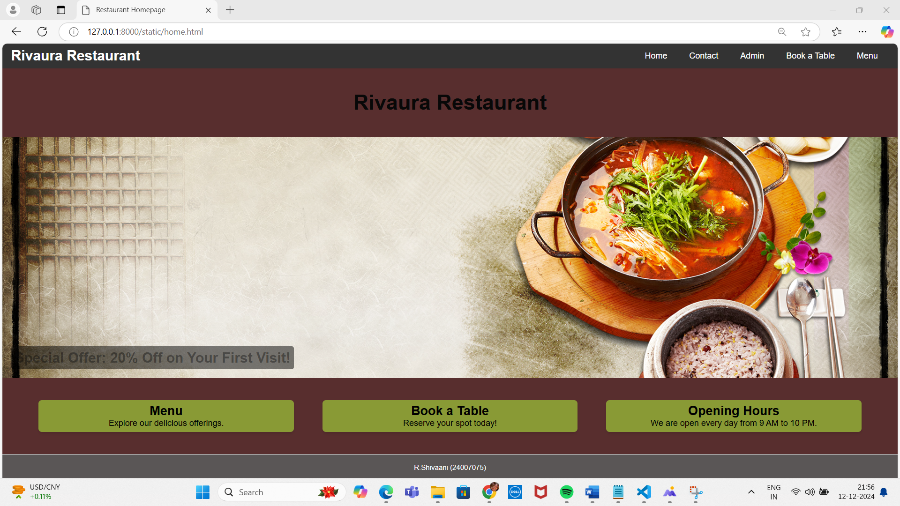
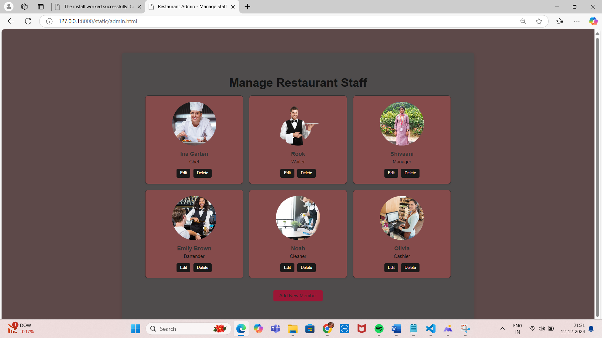
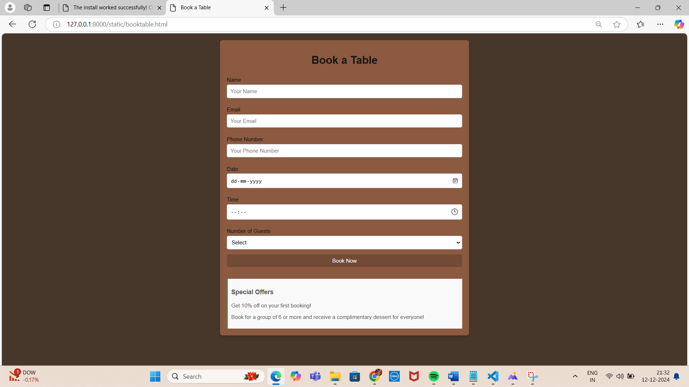
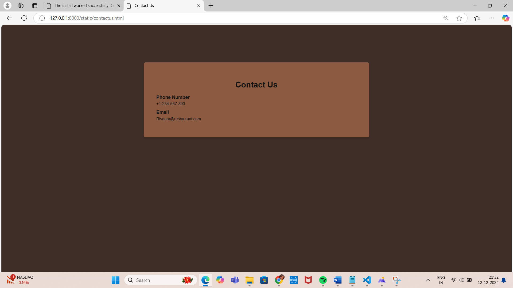
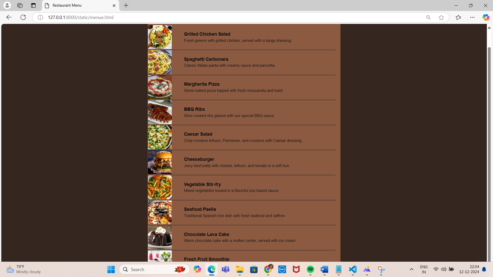
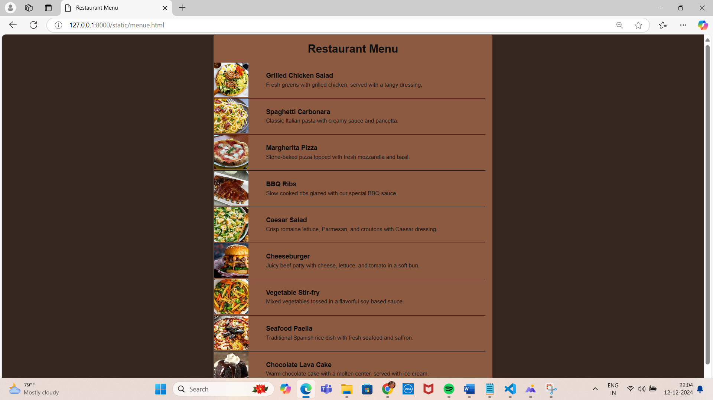

# Ex.07 Restaurant Website
## Date:12:12:24

## AIM:
To develop a static Restaurant website to display the food items and services provided by them.

## DESIGN STEPS:

### Step 1:
Requirement collection.

### Step 2:
Creating the layout using HTML and CSS.

### Step 3:
Updating the sample content.

### Step 4:
Choose the appropriate style and color scheme.

### Step 5:
Validate the layout in various browsers.

### Step 6:
Validate the HTML code.

### Step 7:
Publish the website in the given URL.

## PROGRAM:
```
home

<!DOCTYPE html>
<html lang="en">
<head>
    <meta charset="UTF-8">
    <meta name="viewport" content="width=device-width, initial-scale=1.0">
    <title>Restaurant Homepage</title>
    <style>
        * {
            margin: 0;
            padding: 0;
            box-sizing: border-box;
        }

        body {
            font-family: Arial, sans-serif;
        }

        /* Navbar Styles */
        nav {
            background-color: #333;
            padding: 10px 20px;
            display: flex;
            justify-content: space-between;
            align-items: center;
        }

        nav .logo h1 {
            color: white;
            font-size: 2rem;
        }

        nav .nav-links {
            list-style-type: none;
            display: flex;
        }

        nav .nav-links li {
            margin: 0 15px;
        }

        nav .nav-links a {
            text-decoration: none;
            color: white;
            font-size: 1.2rem;
            padding: 5px 10px;
            border-radius: 4px;
            transition: background-color 0.3s;
        }

        nav .nav-links a:hover {
            background-color: #555;
        }

        header {
            text-align: center;
            padding: 50px 0;
            background-color: #582e2e;
            color: rgb(8, 8, 8);
        }

        h1 {
            font-size: 3rem;
        }

        .offer-banner {
            position: relative;
            background-image: url('offerbackground.jpg'); /* replace with your image URL */
            background-size: cover;
            background-position: center;
            height: 550px;
        }

        .offer-text {
            position: absolute;
            bottom: 20px;
            left: 20px;
            color: rgba(13, 12, 13, 0.41);
            background-color: rgba(0, 0, 0, 0.5);
            padding: 8px;
            border-radius: 5px;
        }

        .offer-text h2 {
            font-size: 2rem;
        }

        .info-cards {
            display: flex;
            justify-content: space-around;
            padding: 50px;
            background-color: #582e2e;
        }

        .card {
            background-color: #899a35;
            width: 30%;
            padding: 8px;
            box-shadow: 0 4px 6px rgba(0, 0, 0, 0.1);
            text-align: center;
            border-radius: 8px;
        }

        .card h3 {
            font-size: 1.8rem;
            margin-bottom: 1px;
        }

        .card p {
            font-size: 1.2rem;
        }

        footer {
            text-align: center;
            padding: 20px;
            background-color: #5a5656;
            color: white;
            margin-top: 1px;
        }

        footer p {
            font-size: 1rem;
        }
    </style>
</head>
<body>

    <!-- Navbar -->
    <nav>
        <div class="logo">
            <h1>Rivaura Restaurant</h1>
        </div>
        <ul class="nav-links">
            <li><a href="home.html">Home</a></li>
            <li><a href="contactus.html">Contact</a></li>
            <li><a href="admin.html">Admin</a></li>
            <li><a href="booktable.html">Book a Table</a></li>
            <li><a href="menue.html">Menu</a></li>
        </ul>
    </nav>

    <!-- Header Section -->
    <header>
        <h1>Rivaura Restaurant</h1>
    </header>

    <!-- Offer Banner Section -->
    <section class="offer-banner">
        <div class="offer-text">
            <h2>Special Offer: 20% Off on Your First Visit!</h2>
        </div>
    </section>

    <!-- Info Cards Section -->
    <section class="info-cards">
        <div class="card">
            <h3>Menu</h3>
            <p>Explore our delicious offerings.</p>
        </div>
        <div class="card">
            <h3>Book a Table</h3>
            <p>Reserve your spot today!</p>
        </div>
        <div class="card">
            <h3>Opening Hours</h3>
            <p>We are open every day from 9 AM to 10 PM.</p>
        </div>
    </section>

    <!-- Footer Section -->
    <footer>
        <p>R.Shivaani (24007075)</p>
    </footer>

</body>
</html>

contactus

<!DOCTYPE html>
<html lang="en">
<head>
    <meta charset="UTF-8">
    <meta name="viewport" content="width=device-width, initial-scale=1.0">
    <title>Contact Us</title>
    <style>
        body {
            font-family: Arial, sans-serif;
            margin: 0;
            padding: 0;
            background-color: rgb(63, 46, 39);
            background-size: cover;
            background-repeat: no-repeat;
            background-position: center;
        }
        .contact {
            max-width: 800px;
            margin: 150px auto;
            padding: 50px;
            background: #8b5a41;
            box-shadow: 0 4px 8px rgba(0, 0, 0, 0.1);
            border-radius: 8px;
        }
        .contact h1 {
            text-align: center;
            color: #121212;
        }
        .contact-item {
            margin-bottom: 15px;
        }
        .contact-item h3 {
            margin: 0 0 5px;
            color: #191919;
        }
        .contact-item p {
            margin: 0;
            color: #161616;
        }
    </style>
</head>
<body>
    <div class="contact">
        <h1>Contact Us</h1>
        <div class="contact-item">
            <h3>Phone Number</h3>
            <p>+1-234-567-890</p>
        </div>
        <div class="contact-item">
            <h3>Email</h3>
            <p>Rivaura@restaurant.com</p>
        </div>
    </div>
</body>
</html>

menue

<!DOCTYPE html>
<html lang="en">
<head>
    <meta charset="UTF-8">
    <meta name="viewport" content="width=device-width, initial-scale=1.0">
    <title>Restaurant Menu</title>
    <style>
        body {
            font-family: Arial, sans-serif;
            margin: 0;
            padding: 0;
            background-color: #35261f;
        }
        .menu {
            max-width: 800px;
            margin: 1px auto;
            padding: 0.5px;
            background: #8b5a41;
            box-shadow: 0 4px 8px rgba(0, 0, 0, 0.1);
            border-radius: 5px;
        }
        .menu h1 {
            text-align: center;
            color: #101010;
        }
        .menu-item {
            display: flex;
            align-items: center;
            margin-right: 20px;
            border-bottom: 1px solid #161616;
            padding-bottom: 3px;
        }
        .menu-item img {
            width: 100px;
            height: 100px;
            object-fit: cover;
            border-radius: 3px;
            margin-right: 50px;
        }
        .menu-item h3 {
            margin: 0 0 5px;
            color: #0f0d0d;
        }
        .menu-item p {
            margin: 0;
            color: #171515;
        }
    </style>
</head>
<body>
    <div class="menu">
        <h1>Restaurant Menu</h1>
        <div class="menu-item">
            
            <div>
                <h3>Grilled Chicken Salad</h3>
                <p>Fresh greens with grilled chicken, served with a tangy dressing.</p>
            </div>
        </div>
        <div class="menu-item">
            
            <div>
                <h3>Spaghetti Carbonara</h3>
                <p>Classic Italian pasta with creamy sauce and pancetta.</p>
            </div>
        </div>
        <div class="menu-item">
            
            <div>
                <h3>Margherita Pizza</h3>
                <p>Stone-baked pizza topped with fresh mozzarella and basil.</p>
            </div>
        </div>
        <div class="menu-item">
            
            <div>
                <h3>BBQ Ribs</h3>
                <p>Slow-cooked ribs glazed with our special BBQ sauce.</p>
            </div>
        </div>
        <div class="menu-item">
            
            <div>
                <h3>Caesar Salad</h3>
                <p>Crisp romaine lettuce, Parmesan, and croutons with Caesar dressing.</p>
            </div>
        </div>
        <div class="menu-item">
            
            <div>
                <h3>Cheeseburger</h3>
                <p>Juicy beef patty with cheese, lettuce, and tomato in a soft bun.</p>
            </div>
        </div>
        <div class="menu-item">
            
            <div>
                <h3>Vegetable Stir-fry</h3>
                <p>Mixed vegetables tossed in a flavorful soy-based sauce.</p>
            </div>
        </div>
        <div class="menu-item">
            
            <div>
                <h3>Seafood Paella</h3>
                <p>Traditional Spanish rice dish with fresh seafood and saffron.</p>
            </div>
        </div>
        <div class="menu-item">
            
            <div>
                <h3>Chocolate Lava Cake</h3>
                <p>Warm chocolate cake with a molten center, served with ice cream.</p>
            </div>
        </div>
        <div class="menu-item">
            
            <div>
                <h3>Fresh Fruit Smoothie</h3>
                <p>A refreshing blend of seasonal fruits and yogurt.</p>
            </div>
        </div>
    </div>
</body>
</html>

bookatable

<!DOCTYPE html>
<html lang="en">
<head>
    <meta charset="UTF-8">
    <meta name="viewport" content="width=device-width, initial-scale=1.0">
    <title>Book a Table</title>
    <style>
        body {
            font-family: Arial, sans-serif;
            margin: 0;
            padding: 0;
            background-color: rgb(71, 55, 42);
            background-size: cover;
            background-repeat: no-repeat;
            background-position: center;
        }
        .booking {
            max-width: 700px;
            margin: 20px auto;
            padding: 20px;
            background: #8b5a41;
            box-shadow: 0 4px 8px rgba(0, 0, 0, 0.2);
            border-radius: 8px;
        }
        .booking h1 {
            text-align: center;
            color: #171616;
        }
        .booking form {
            display: flex;
            flex-direction: column;
        }
        .booking label {
            margin: 10px 0 5px;
            color: #0f0e0e;
        }
        .booking input, .booking select, .booking button {
            padding: 10px;
            margin-bottom: 15px;
            border: 1px solid #ccc;
            border-radius: 5px;
            font-size: 16px;
        }
        .booking button {
            background-color: #724a35;
            color: white;
            border: none;
            cursor: pointer;
        }
        .booking button:hover {
            background-color: #218838;
        }
        .offers {
            margin-top: 20px;
            padding: 10px;
            background: #f9f9f9;
            border-left: 4px solid #28a745;
            color: #555;
        }
    </style>
</head>
<body>
    <div class="booking">
        <h1>Book a Table</h1>
        <form>
            <label for="name">Name</label>
            <input type="text" id="name" name="name" placeholder="Your Name" required>

            <label for="email">Email</label>
            <input type="email" id="email" name="email" placeholder="Your Email" required>

            <label for="phone">Phone Number</label>
            <input type="tel" id="phone" name="phone" placeholder="Your Phone Number" required>

            <label for="date">Date</label>
            <input type="date" id="date" name="date" required>

            <label for="time">Time</label>
            <input type="time" id="time" name="time" required>

            <label for="guests">Number of Guests</label>
            <select id="guests" name="guests" required>
                <option value="">Select</option>
                <option value="1">1</option>
                <option value="2">2</option>
                <option value="3">3</option>
                <option value="4">4</option>
                <option value="5">5</option>
                <option value="6">6</option>
                <option value="7">7</option>
                <option value="8">8</option>
            </select>

            <button type="submit">Book Now</button>
        </form>

        <div class="offers">
            <h3>Special Offers</h3>
            <p>Get 10% off on your first booking!</p>
            <p>Book for a group of 6 or more and receive a complimentary dessert for everyone!</p>
        </div>
    </div>
</body>
</html>

admin

<!DOCTYPE html>
<html lang="en">
<head>
    <meta charset="UTF-8">
    <meta name="viewport" content="width=device-width, initial-scale=1.0">
    <title>Restaurant Admin - Manage Staff</title>
    <style>
        /* Basic Reset */
        * {
            margin: 0;
            padding: 0;
            box-sizing: border-box;
        }

        body {
            font-family: Arial, sans-serif;
            background-color: #5d4949;
            color: #333;
            padding: 80px;
        }

        .admin-dashboard {
            max-width: 1200px;
            margin: 0 auto;
            background-color: rgb(79, 76, 76);
            padding: 80px;
            border-radius: 10px;
            box-shadow: 0 2px 10px rgba(0, 0, 0, 0.1);
        }

        header {
            text-align: center;
            margin-bottom: 20px;
        }

        header h1 {
            font-size: 2.5rem;
            color: #141414;
        }

        .members-list {
            display: grid;
            grid-template-columns: repeat(3, 1fr);
            gap: 20px;
            margin-top: 20px;
        }

        .member-card {
            background-color: #854b4b;
            border: 1px solid #2c2b2b;
            padding: 20px;
            border-radius: 10px;
            text-align: center;
            box-shadow: 0 2px 5px rgba(0, 0, 0, 0.1);
            transition: transform 0.3s;
        }

        .member-card:hover {
            transform: scale(1.05);
        }

        .member-photo {
            width: 150px;
            height: 150px;
            border-radius: 50%;
            object-fit: cover;
            margin-bottom: 15px;
        }

        .member-name {
            font-size: 1.2rem;
            font-weight: bold;
            margin-bottom: 5px;
        }

        .member-role {
            font-size: 1rem;
            color: #100f0f;
            margin-bottom: 15px;
        }

        .action-buttons {
            display: flex;
            justify-content: center;
            gap: 10px;
        }

        .action-buttons button {
            padding: 8px 12px;
            background-color: #1a1919;
            color: white;
            border: none;
            border-radius: 5px;
            cursor: pointer;
            transition: background-color 0.3s;
        }

        .action-buttons button:hover {
            background-color: #753b3b;
        }

        .add-member {
            text-align: center;
            margin-top: 40px;
        }

        .add-member button {
            padding: 10px 20px;
            background-color: #9b1635;
            color: rgb(45, 40, 40);
            border: none;
            border-radius: 5px;
            font-size: 1rem;
            cursor: pointer;
        }

        .add-member button:hover {
            background-color: #506d5a;
        }
    </style>
</head>
<body>
    <div class="admin-dashboard">
        <header>
            <h1>Manage Restaurant Staff</h1>
        </header>

        <div class="members-list">
            <!-- Member 1 -->
            <div class="member-card">
                
                <div class="member-name">Ina Garten</div>
                <div class="member-role">Chef</div>
                <div class="action-buttons">
                    <button>Edit</button>
                    <button>Delete</button>
                </div>
            </div>

            <!-- Member 2 -->
            <div class="member-card">
                
                <div class="member-name">Rook</div>
                <div class="member-role">Waiter</div>
                <div class="action-buttons">
                    <button>Edit</button>
                    <button>Delete</button>
                </div>
            </div>

            <!-- Member 3 -->
            <div class="member-card">
                
                <div class="member-name">Shivaani</div>
                <div class="member-role">Manager</div>
                <div class="action-buttons">
                    <button>Edit</button>
                    <button>Delete</button>
                </div>
            </div>

            <!-- Member 4 -->
            <div class="member-card">
                
                <div class="member-name">Emily Brown</div>
                <div class="member-role">Bartender</div>
                <div class="action-buttons">
                    <button>Edit</button>
                    <button>Delete</button>
                </div>
            </div>

            <!-- Member 5 -->
            <div class="member-card">
                
                <div class="member-name">Noah</div>
                <div class="member-role">Cleaner</div>
                <div class="action-buttons">
                    <button>Edit</button>
                    <button>Delete</button>
                </div>
            </div>

            <!-- Member 6 -->
            <div class="member-card">
                
                <div class="member-name">Olivia</div>
                <div class="member-role">Cashier</div>
                <div class="action-buttons">
                    <button>Edit</button>
                    <button>Delete</button>
                </div>
            </div>
        </div>

        <div class="add-member">
            <button>Add New Member</button>
        </div>
    </div>
</body>
</html>


```

## OUTPUT:



  



## RESULT:
The program for designing software company website using HTML and CSS is completed successfully.
